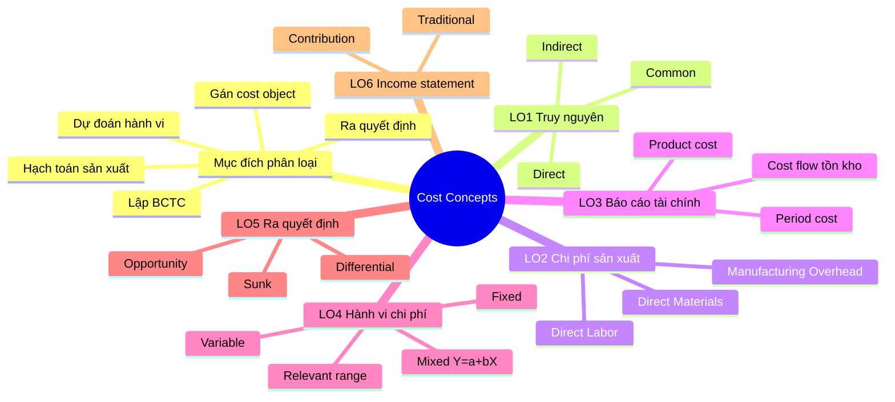
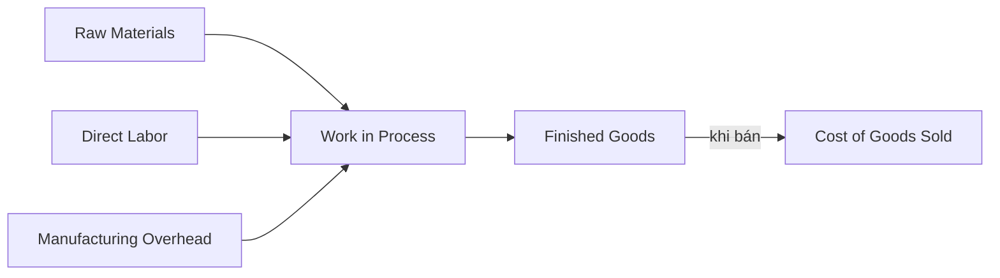

# Spec — Rich Teaching Mode (visual giảng bài) · Pilot Chương 1
> Claude (đầu não) → Codex (executor). Mục tiêu: nâng phần GIẢNG BÀI từ "chữ đặc" lên trực quan (mindmap, sơ đồ, bảng so sánh, callout insight/bẫy/chốt, ví dụ thực tế) để hiểu tối đa.
> Quyết định đã chốt với Chaliyah: **(1) phong cách Edu giàu màu; (2) diagram Hybrid = Mermaid + vài component React/SVG "chữ ký"; (3) PILOT trên Chương 1 trước, chốt gu rồi nhân rộng.**

---

## A. Nâng schema `content/types.ts` (lần này ĐƯỢC sửa types.ts — quyết định kiến trúc)
Thêm hệ **Block** (additive, không phá schema cũ; `body` thành optional để section cũ vẫn chạy).

```ts
export type CalloutKind = "insight" | "trap" | "key" | "brainstorm" | "realworld" | "note";
export type Callout = { kind: CalloutKind; title?: string; body: string };

export type Diagram = {
  engine: "mermaid";
  title?: string;
  code: string;       // mã Mermaid (mindmap / flowchart / graph)
  caption?: string;
};

export type ComparisonTable = {
  title?: string;
  columns: string[];                               // tiêu đề cột (cột đầu = nhãn hàng)
  rows: { label: string; cells: string[] }[];
};

export type CalcStep = { label: string; expr: string; note?: string };
export type CalcWalkthrough = { title?: string; steps: CalcStep[]; result?: string };

export type Formula = { expression: string; legend?: { symbol: string; meaning: string }[]; note?: string };

export type Figure = { caption: string; src?: string; placeholder?: boolean; alt?: string };

export type Block =
  | { type: "prose"; body: string }
  | { type: "callout"; callout: Callout }
  | { type: "diagram"; diagram: Diagram }
  | { type: "comparison"; table: ComparisonTable }
  | { type: "calc"; calc: CalcWalkthrough }
  | { type: "formula"; formula: Formula }
  | { type: "figure"; figure: Figure };

// Section: thêm blocks?, body? optional
export type Section = {
  id: string;
  heading: string;
  body?: string;          // giữ tương thích; nếu có blocks thì ưu tiên blocks
  blocks?: Block[];
  keyTerms?: KeyTerm[];
  examples?: Example[];
};

// Chapter: thêm knowledge map đầu chương
export type Chapter = {
  /* …giữ nguyên các field cũ… */
  knowledgeMap?: Diagram;   // mindmap tổng quan LO/khái niệm
};
```
> Quy tắc render: nếu `section.blocks` có → render lần lượt block; nếu không → fallback `body` như cũ. `keyTerms`/`examples` vẫn render sau cùng.

---

## B. Component cho Codex (thư mục `app/components/teaching/`)
- `BlockRenderer.tsx` — switch theo `block.type`.
- `Callout.tsx` — màu + icon theo `kind` (bảng tokens §C).
- `MermaidDiagram.tsx` — **client component**; render Mermaid từ `code`; có `caption`. Lazy-load `mermaid`, theme khớp dark/light.
- `ComparisonTable.tsx` — bảng 2+ cột, header tô màu, zebra rows.
- `CalcWalkthrough.tsx` — danh sách bước `label → expr` (mono), `note` mờ, `result` nhấn mạnh ở cuối.
- `FormulaBlock.tsx` — công thức (font mono/serif), legend ký hiệu.
- `Figure.tsx` — nếu `placeholder:true` → khung nét đứt + caption "[Hình minh hoạ — chờ ảnh thật]" (KHÔNG bịa ảnh).
- `KnowledgeMap.tsx` — bọc `MermaidDiagram` mindmap, đặt ngay dưới bigIdea.
- `ChapterTOC.tsx` — mục lục dính (sticky) bên trái ở màn rộng, nhảy tới từng section/LO.
- Cập nhật `app/chapters/[slug]/page.tsx`: render `knowledgeMap` + dùng `BlockRenderer`; layout 2 cột (TOC trái + nội dung) ở `lg`.

---

## C. Design tokens — Edu giàu màu (Tailwind, kèm dark)
| Callout kind | Ý nghĩa | Màu viền/nền | Icon |
|---|---|---|---|
| `insight` | Góc nhìn sâu | indigo (`border-indigo-400 bg-indigo-50 dark:bg-indigo-950/40`) | 💡 |
| `trap` | Bẫy hay nhầm | rose (`border-rose-400 bg-rose-50 dark:bg-rose-950/40`) | ⚠️ |
| `key` | Chốt nhớ | amber (`border-amber-400 bg-amber-50 dark:bg-amber-950/30`) | 🔑 |
| `brainstorm` | Câu hỏi kích tư duy | violet (`border-violet-400 bg-violet-50 dark:bg-violet-950/40`) | 🧠 |
| `realworld` | Ví dụ thực tế | emerald (`border-emerald-400 bg-emerald-50 dark:bg-emerald-950/40`) | 🌍 |
| `note` | Ghi chú | zinc (`border-zinc-300 bg-zinc-50 dark:bg-zinc-900`) | 📝 |

- Callout: viền trái 4px + icon tròn + `title` đậm. Bo `rounded-xl`, `p-4`.
- Diagram/figure: card `rounded-2xl border`, caption `text-xs text-zinc-500` ở dưới.
- ComparisonTable: header `bg-zinc-100 dark:bg-zinc-800`, viền `rounded-xl overflow-hidden`.
- Section heading có anchor id để TOC nhảy tới. bigIdea hero giữ phong cách hiện tại nhưng nhấn hơn.
- Spacing thoáng: `space-y-6` trong section; giữ `max-w` rộng hơn (`max-w-4xl`) khi có TOC.

---

## D. Nội dung block — CHƯƠNG 1 `cost-concepts` (đầu não soạn; số liệu bám slide)
> Codex thêm `blocks` cho từng section dưới đây (giữ nguyên `body` cũ làm `prose` đầu tiên hoặc tách hợp lý). Mọi số liệu Phở/ví dụ = từ slide; không bịa thêm.

### knowledgeMap (đặt đầu chương)


### s0 — Managerial vs Financial
- **comparison** — columns `["Tiêu chí","Financial","Managerial"]`; rows:
  - Đối tượng → "Bên ngoài (cổ đông, chủ nợ, cơ quan)" | "Nhà quản trị bên trong"
  - Mục đích → "Báo cáo tuân thủ" | "Plan / Control / Decide"
  - Chuẩn mực → "Bắt buộc (GAAP/IFRS)" | "Linh hoạt"
  - Hướng thời gian → "Quá khứ" | "Tương lai"
- **diagram** (mermaid flowchart) — "5 mục đích phân loại chi phí" toả ra từ 1 node trung tâm.
- **brainstorm** callout: "Trước khi học cách phân loại, hỏi: *bạn đang cần con số chi phí để LÀM GÌ?* — câu trả lời quyết định lăng kính."

### s-pho — Case study quán Phở
- **realworld** callout (title "Quán Phở xuyên suốt"): tóm tắt doanh thu 3.000 tô × 50.000đ = 150tr + danh mục chi phí (đúng số slide).
- **figure** placeholder: "Sơ đồ quán phở & dòng chi phí" (chờ ảnh thật nếu muốn) — hoặc bỏ nếu không cần.
- **brainstorm** callout: 2 câu gài của slide ("lợi nhuận 3.000 vs 4.000 tô?", "yếu tố nào làm chi phí mỗi tô đổi?").

### s1 — LO1 direct/indirect/common
- **diagram** (mermaid flowchart): "Một khoản chi" → hỏi "Truy nguyên kinh tế tới cost object?" → Có=Direct / Không=Indirect → Indirect phục vụ nhiều object = Common.
- **trap** callout: "direct/indirect KHÔNG cố định — đổi cost object có thể đổi nhãn." (nối q6)

### s2 — LO2 DM/DL/MOH
- **diagram** (mermaid): "Chi phí sản xuất" chia 3 nhánh DM / DL / MOH (MOH liệt kê indirect materials, indirect labor, khấu hao/điện/thuế nhà máy).
- **realworld** callout: ánh xạ Phở (DM thịt/bánh; DL đầu bếp; MOH điện bếp, khấu hao thiết bị).

### s3 — Prime & Conversion
- **diagram** (mermaid hoặc custom Venn): hai vòng Prime(DM,DL) & Conversion(DL,MOH) giao nhau ở **DL**.
- **trap** callout: "DL nằm ở CẢ hai nhóm — bẫy kinh điển."

### s4 — Selling & Administrative
- **comparison** columns `["", "Selling","Administrative"]`; rows: Bản chất → "Có đơn + giao hàng" | "Điều hành, hành chính"; Ví dụ → "Quảng cáo, hoa hồng, vận chuyển" | "Lương BGĐ, kế toán, văn phòng".

### s5 — LO3 Product vs Period
- **comparison** columns `["", "Product cost","Period cost"]`; rows: Gồm → "DM+DL+MOH" | "Selling + Administrative"; Khi nào thành chi phí → "Khi BÁN (→COGS)" | "Ngay trong kỳ"; Trên báo cáo → "Inventory→COGS" | "Expense ngay".
- **key** callout: "Product cost 'nằm chờ' trong tồn kho tới khi bán; period cost tính thẳng vào kỳ."

### s6 — Cost flow tồn kho
- **diagram** — **component React/SVG "chữ ký"** (đẹp): Raw Materials → Work in Process → Finished Goods → COGS, với DL & MOH bơm vào WIP. (Mermaid flowchart làm bản dự phòng.)

- **insight** callout: "Một đồng product cost chỉ thành chi phí trên Income Statement ĐÚNG LÚC sản phẩm được bán."

### s7 — LO4 Variable & activity base
- **diagram** (mermaid): mini-graph mô tả tổng biến phí tăng tuyến tính theo activity; đơn vị phẳng.
- **realworld** callout: Baskin & Robbins — kem + giấy ăn biến đổi theo số cây kem.

### s8 — Fixed: committed/discretionary + hành vi đơn vị
- **comparison** columns `["", "Committed","Discretionary"]`; rows: Thời hạn → "Dài hạn, khó cắt" | "Ngắn hạn, linh hoạt"; Ví dụ → "Khấu hao, thuê dài hạn" | "Quảng cáo, đào tạo, R&D".
- **insight** callout: "Tổng fixed phẳng nhưng fixed/ĐƠN VỊ giảm khi sản lượng tăng → lý do chi phí mỗi tô phở đổi." (nối q3)

### s9 — Relevant range & linearity
- **diagram** (mermaid/custom): đường cong thực tế vs đường thẳng xấp xỉ; tô vùng relevant range; minh hoạ step cost khi vượt range.

### s10 — Mixed cost Y=a+bX
- **formula**: expression `Y = a + bX`; legend Y=tổng, a=định phí, b=biến phí/đơn vị, X=mức hoạt động.
- **calc** (title "Ví dụ hoá đơn điện"): steps — "Định phí a → 40"; "Biến phí b×X → 0,03 × 2.000 = 60"; result "Y = 100".
- **trap** callout: "Đừng gộp định phí vào đơn giá biến đổi (bẫy đáp án 0,04×2.000)."

### s11 — LO5 differential/opportunity/sunk
- **diagram** (mermaid flowchart): "Chi phí có THÍCH HỢP với quyết định?" → hỏi "Tương lai?" & "Khác biệt giữa phương án?" → cả hai Có = relevant; sunk (quá khứ) = bỏ; opportunity = cộng thêm dù ngoài sổ.
- **realworld** callout: Phở — 15tr cho thuê nhà + 10tr lương đi làm nơi khác = opportunity cost.
- **key** callout: "Chi phí thích hợp = TƯƠNG LAI + KHÁC BIỆT."

### s12 — LO6 Traditional vs Contribution
- **comparison** (hoặc component side-by-side "chữ ký") columns `["Dòng","Traditional","Contribution"]`; rows dựng từ ví dụ slide (Sales 100.000):
  - Sales → 100.000 | 100.000
  - Trừ → "COGS 70.000" | "Variable 60.000"
  - = Margin → "Gross margin 30.000" | "Contribution margin 40.000"
  - Trừ → "S&A 20.000" | "Fixed 30.000"
  - = NOI → 10.000 | 10.000
- **trap** callout: "Gross margin ≠ Contribution margin (gom theo CHỨC NĂNG vs HÀNH VI)."
- **insight** callout: "Contribution margin là nền cho CVP (Ch.5), budgeting (Ch.8), special decisions (Ch.13)."

---

## E. Lưu ý
- Trung thực học thuật: số liệu chỉ từ slide; ví dụ thực tế (B&R, hoá đơn điện, xe) là ví dụ khái niệm của giáo trình. Không bịa ảnh — dùng diagram text hoặc `figure.placeholder`.
- Sau khi pilot Chương 1 được Chaliyah duyệt gu → nhân block sang Chương 2 và mọi chương mới (mặc định có `blocks` ngay từ spec).
- Quiz (`QuizPlayer`) giữ nguyên; chỉ phần giảng bài đổi.

---

## F. Revision v2 — GIẢM NHIỄU (sau pilot: bị "rối, đặc, lặp")
> Triết lý mới: **ít hơn = tốt hơn**. Mỗi ý xuất hiện ĐÚNG MỘT LẦN ở định dạng tốt nhất. Trang phải "thở".

**F1. Khử trùng lặp (quan trọng nhất)**
- Bỏ hẳn việc lặp: khi section có `blocks`, **xoá `body` cũ** (đang trùng với `blocks[0]` prose). Không giữ cả hai.
- Callout/table/diagram **KHÔNG được nhắc lại** điều prose đã nói. Mỗi block thêm GIÁ TRỊ MỚI:
  - comparison table **thay thế** đoạn liệt kê trong prose (cắt câu liệt kê khỏi prose).
  - `realworld` callout chỉ chứa **ánh xạ/insight** (vd "ở Phở: DM=thịt/bánh, DL=đầu bếp…"), KHÔNG chép lại bảng số liệu đã có ở s-pho.
- s-pho: số liệu chi phí nêu **một chỗ** (ưu tiên một bảng gọn), bỏ phần prose liệt kê trùng và bỏ `figure` placeholder (đang tạo hộp nét đứt thừa).

**F2. Trần ngân sách thị giác mỗi section**
- Tối đa **1 visual nặng** (diagram HOẶC table) + tối đa **1 callout** mỗi section. Nếu cần nhiều hơn → tách ý, đừng nhồi.
- Cả chương: callout chỉ dùng cho điểm thật đắt (bẫy/chốt/insight chính), không rải mỗi section.

**F3. Giảm "chrome" (viền/shadow/nền)**
- prose: chữ trơn, KHÔNG card. Tăng `leading-8`, giới hạn **`max-w-2xl` (~65–70 ký tự/dòng)** cho mọi đoạn đọc.
- diagram/table: viền mảnh `border-zinc-200`, **bỏ shadow**, nền trắng/zinc-50 nhẹ.
- Bỏ `shadow-sm` ở hero bigIdea và các card; dùng khoảng trắng để phân tách thay vì đường viền.

**F4. Hệ màu callout — TỪ cầu vồng → trầm tĩnh**
- Mặc định callout: **nền trung tính** (white/zinc-50) + **chỉ icon và nhãn có màu** + **viền trái 3px màu theo kind**. KHÔNG tô nền bão hoà cả khối.
- Chỉ `trap` (đỏ) và `key` (vàng) được nền nhạt nhẹ để nổi; `insight/realworld/brainstorm/note` dùng nền trung tính + accent nhỏ. Giảm số màu bật đồng thời.

**F5. Knowledge map gọn lại**
- Thay mindmap Mermaid sprawl bằng **overview gọn**: hàng "chips" LO1–LO6 (mỗi chip: mã LO + 3–4 từ khoá), có thể bấm nhảy tới section. Nếu vẫn muốn mindmap → để trong khối **thu gọn được (collapsible)**, mặc định đóng, style khớp tông (không dùng theme mặc định Mermaid).

**F6. Nhịp & thứ bậc**
- Khoảng cách giữa section lớn hơn (`space-y-16`), trong section `space-y-4`.
- keyTerms: gộp thành một danh sách định nghĩa **nhẹ** (không phải card xám đậm); examples: viền mảnh, nền trắng.
- Một section điển hình nên đọc như: **đoạn giảng ngắn → (1 visual) → (tối đa 1 callout chốt)**. Hết.

**F7. Áp dụng**
- Sửa component (`Callout`, `MermaidDiagram`/KnowledgeMap, `ComparisonTable`, page layout) theo F3–F6 + dọn nội dung Chương 1 theo F1–F2 (đặc biệt s0, s-pho, s2, s8, s12 đang dày nhất).
- Vẫn pilot Chương 1; chốt gu rồi mới nhân rộng.

---

## G. Revision v3 — GRAPH/MODEL TƯƠNG TÁC (graph đang rối & kém hiệu quả)
> Mục tiêu: graph **gọn, dễ hiểu, đẹp, có tương tác**. Chuyển sơ đồ "chữ ký" từ Mermaid tĩnh → **React Flow** (`@xyflow/react`); Mermaid chỉ còn cho sơ đồ phụ rất đơn giản.

**G1. Schema — thêm engine `flow`** (mở rộng `Diagram` thành union, vẫn giữ `mermaid`)
```ts
export type FlowNode = {
  id: string;
  label: string;
  group?: "purpose" | "lo" | "concept" | "term";  // để tô màu nhóm (trầm, theo §F4)
  detail?: string;        // hiện trong popover khi click/hover
  parent?: string;        // dùng cho cây thu gọn (knowledge map)
};
export type FlowEdge = { from: string; to: string; label?: string };

export type Diagram =
  | { engine: "mermaid"; title?: string; code: string; caption?: string }
  | { engine: "flow"; title?: string; layout?: "tree" | "horizontal" | "radial";
      nodes: FlowNode[]; edges: FlowEdge[]; collapsible?: boolean; caption?: string };
```

**G2. Component `FlowDiagram.tsx`** (client, `@xyflow/react`)
- Tính năng tương tác: **pan/zoom + fitView**, `Controls` tối giản, ẩn attribution; KHÔNG minimap (cho gọn) trừ knowledge map lớn.
- **Hover node** → highlight node + cạnh liên quan, làm mờ phần còn lại (đổi opacity).
- **Click node** → mở popover nhỏ hiển thị `detail` (nếu có); nếu node có con & `collapsible` → toggle ẩn/hiện nhánh con.
- **Custom node** (`nodeTypes`): card bo `rounded-xl`, viền mảnh, nền theo `group` (tông trầm §F4: purpose=indigo nhạt, lo=amber nhạt, concept=zinc, term=emerald nhạt) — chỉ viền/nhãn có màu, không bão hoà.
- Layout: dùng `layout` để set vị trí (tree = phân tầng trái→phải hoặc trên→dưới; horizontal cho cost flow; radial cho knowledge map). Có thể tính toạ độ đơn giản bằng tầng (depth) để khỏi cần thư viện layout nặng.
- Khung: chiều cao cố định hợp lý (vd `h-[360px]` mobile, `h-[440px]` desktop), `rounded-2xl border` mảnh, **không shadow**; caption dưới.
- Accessibility: nút "Mở rộng tất cả / Thu gọn" cho cây; node focus được bằng bàn phím.

**G3. KnowledgeMap → cây thu gọn (sửa sprawl)**
- Dùng `engine:"flow"`, `layout:"tree"`, `collapsible:true`. **Mặc định chỉ hiện root + 7 nhánh cấp 1** (5 mục đích gộp thành 1 nhánh "Mục đích phân loại" + LO1…LO6). Bấm một nhánh mới bung khái niệm con.
- Bỏ mindmap Mermaid cũ.

**G4. Sơ đồ nào dùng `flow` (interactive), cái nào để Mermaid**
- `flow`: **knowledge map** (cây), **cost flow s6** (horizontal, cạnh có hướng/animated, click node xem `detail`), **decision tree s1** (direct/indirect/common), **decision tree s11** (relevant cost: Tương lai? + Khác biệt? → relevant), **phân rã DM/DL/MOH s2**.
- Mermaid (giữ, đơn giản): s0 "5 mục đích" (hoặc gộp vào knowledge map), s3 Venn prime/conversion, s7/s9 mini-graph hành vi chi phí.

**G5. Dữ liệu mẫu — knowledge map (flow, tree, collapsible)** *(Codex dựng theo, bỏ mindmap cũ)*
- nodes (rút gọn cấp 1; cấp 2 là con, ẩn mặc định):
  - root: `{id:"root", label:"Cost Concepts", group:"concept"}`
  - cấp 1: `purpose`(label "Mục đích phân loại", parent root), `lo1`…`lo6` (group:"lo", parent root, label "LO1 Truy nguyên"…"LO6 Income statement").
  - cấp 2 ví dụ: dưới `lo3` → `{id:"lo3-product",label:"Product cost",group:"concept",parent:"lo3"}`, `lo3-period`, `lo3-flow`; dưới `purpose` → 5 node mục đích. (Codex điền nốt các LO theo nội dung mindmap cũ ở §D.)
- edges: root→purpose, root→lo1…lo6, lo*→con tương ứng.

**G6. Dữ liệu mẫu — cost flow s6 (flow, horizontal)**
- nodes: `RM`("Raw Materials"), `WIP`("Work in Process"), `FG`("Finished Goods"), `COGS`("Cost of Goods Sold"), `DL`("Direct Labor"), `MOH`("Manufacturing Overhead") — group:"concept"; mỗi node có `detail` (1 câu giải thích).
- edges: RM→WIP, DL→WIP, MOH→WIP, WIP→FG, FG→COGS(label "khi bán"). Cạnh chính RM→WIP→FG→COGS đặt `animated` để thấy dòng chảy.

**G7. Áp dụng**
- Cài `@xyflow/react`; import CSS của nó. Tạo `FlowDiagram.tsx` + custom node. `BlockRenderer` chọn component theo `diagram.engine` (`flow`→FlowDiagram, `mermaid`→MermaidDiagram).
- Chuyển các diagram ở §G4 sang `engine:"flow"` với nodes/edges; giữ caption ngắn.
- Tông màu node tuân §F4 (trầm), spacing tuân §F (gọn). Vẫn pilot Chương 1.

---

## H. `detail` cho các node còn thiếu (bấm node hiện fallback "Bấm các node liên quan…")
> Các node lá của knowledge map + 3 node con graph DM/DL/MOH (s2) chưa có `detail` → popover rơi vào câu mặc định. Điền đúng `detail` (1 câu/khái niệm, bám slide Ch.1) cho từng `id` dưới đây.

**Knowledge map (cấp 2):**
- `purpose-object` → "Đo chi phí gắn cho một cost object cụ thể (sản phẩm, đơn hàng, bộ phận, khách hàng)."
- `purpose-product` → "Tập hợp DM + DL + MOH để tính giá thành sản phẩm sản xuất."
- `purpose-report` → "Phân product/period để định giá tồn kho và tính lợi nhuận trên BCTC."
- `purpose-behavior` → "Dự đoán chi phí thay đổi thế nào khi mức hoạt động tăng/giảm."
- `purpose-decision` → "Lọc ra chi phí thích hợp (relevant) để chọn giữa các phương án."
- `lo1-direct` → "Chi phí truy nguyên dễ dàng, kinh tế tới cost object đang xét."
- `lo1-indirect` → "Chi phí không truy nguyên trực tiếp được → phải phân bổ."
- `lo1-common` → "Indirect cost phục vụ nhiều cost object cùng lúc, không tách riêng cho cái nào."
- `lo2-dm` → "Nguyên vật liệu trở thành một phần sản phẩm và truy nguyên trực tiếp (vd thịt, bánh phở)."
- `lo2-dl` → "Nhân công trực tiếp làm ra sản phẩm, truy nguyên tới đơn vị (vd đầu bếp)."
- `lo2-moh` → "Mọi chi phí sản xuất ngoài DM và DL (indirect materials/labor, khấu hao/điện nhà máy)."
- `lo3-product` → "DM + DL + MOH; nằm trong tồn kho tới khi bán mới thành COGS."
- `lo3-period` → "Selling + administrative; ghi thẳng vào chi phí trong kỳ, không qua tồn kho."
- `lo3-flow` → "Raw Materials → WIP → Finished Goods → COGS: product cost chỉ thành chi phí khi bán."
- `lo4-variable` → "Tổng tăng tỉ lệ theo activity; chi phí trên mỗi đơn vị không đổi."
- `lo4-fixed` → "Tổng không đổi trong relevant range; chi phí trên mỗi đơn vị giảm khi sản lượng tăng."
- `lo4-mixed` → "Có cả định phí lẫn biến phí: Y = a + bX."
- `lo4-range` → "Khoảng hoạt động mà giả định tuyến tính về hành vi chi phí còn đúng."
- `lo5-diff` → "Chênh lệch chi phí/doanh thu giữa hai phương án — luôn thích hợp."
- `lo5-opp` → "Lợi ích bị bỏ lỡ của phương án không chọn; ngoài sổ nhưng vẫn phải cân nhắc."
- `lo5-sunk` → "Chi phí đã phát sinh, không đổi được → luôn không thích hợp."
- `lo6-traditional` → "Sales − COGS = Gross margin; gom chi phí theo CHỨC NĂNG (cho báo cáo ngoài)."
- `lo6-contribution` → "Sales − Variable = Contribution margin; gom chi phí theo HÀNH VI (cho quản trị)."

**Graph DM/DL/MOH (s2):**
- `im` → "Vật liệu phụ không truy nguyên kinh tế tới sản phẩm (vd gia vị, dầu máy) → MOH."
- `il` → "Nhân công không trực tiếp làm ra sản phẩm (vd quản đốc, bảo trì) → MOH."
- `factory` → "Chi phí vận hành nhà máy (khấu hao, điện, thuế tài sản, bảo hiểm) → MOH."

> Sau khi điền: mọi node bấm vào đều có giải thích thật, không còn câu fallback. Kết hợp với việc sửa fallback (ẩn dòng mô tả khi node không có `detail`) cho an toàn về sau.

---

## I. Ví dụ/bài tập: thêm 2 lớp "Ý nghĩa → Dẫn tới" (pilot Chương 1)
> Mục tiêu: với mỗi ví dụ có con số/kết quả, người học hiểu **(a) kết quả này NGHĨA LÀ gì** và **(b) ra như vậy thì DẪN TỚI gì** (hệ quả/quyết định) — không chỉ thấy phép tính.

**I1. Schema** (`content/types.ts`): thêm 2 trường optional vào `Example` (và `CalcWalkthrough` cho tương lai):
```ts
export type Example = {
  title: string;
  body: string;
  meaning?: string;       // kết quả/con số này NGHĨA LÀ gì (diễn giải)
  implication?: string;   // ra như vậy thì DẪN TỚI gì (hệ quả/quyết định)
};
```
**I2. Render** (component Example trong page/BlockRenderer): dưới `body`, nếu có thì hiện 2 dòng nhỏ, nhãn đậm, tông trầm (không phải callout màu):
- **Ý nghĩa:** {meaning}
- **Dẫn tới:** {implication}

**I3. Nội dung Chương 1** (số liệu bám slide; phép cộng Phở là số học kiểm chứng được):

- **s10 — "Tính mixed cost"** (đã có body Y=100/130):
  - meaning: "Hóa đơn 100 = 40 định phí (trả dù dùng ít) + 60 biến phí theo kWh — chi phí vừa cố định vừa biến đổi."
  - implication: "Khi sản lượng đổi, chỉ phần bX đổi còn a giữ nguyên → phải tách a/b mới dự báo & lập budget đúng; coi cả 100 là biến phí sẽ ước sai ở mức hoạt động khác."

- **s2 — "Ánh xạ Phở" (DM/DL/MOH)**:
  - meaning: "Cùng 'chi phí quán phở' nhưng tách thành 3 nhóm product cost theo vai trò trong việc làm ra tô phở."
  - implication: "Phân nhóm đúng là nền để tính giá thành mỗi tô và phân bổ overhead; gộp nhầm MOH vào DM/DL → giá thành sai."

- **s-pho — thêm 1 example "Lợi nhuận kế toán vs kinh tế"**:
  - body: "Doanh thu 150tr − chi phí trên sổ (30+3+9+1,5+0,6+5+3+9+6+3 = 70,1tr) = lợi nhuận kế toán ≈ 79,9tr. Trừ opportunity cost 15tr + 10tr = 25tr."
  - meaning: "Lợi nhuận kinh tế ≈ 79,9 − 25 = 54,9tr — đây mới là cái lời thật sau khi tính cả cơ hội bị bỏ lỡ."
  - implication: "Bỏ quên 25tr opportunity cost khiến ta tưởng lời ~79,9tr (lạc quan quá mức). Quán vẫn đáng làm vì 54,9tr > 0; nếu con số này âm thì nên cho thuê nhà + đi làm thay vì mở quán."

- **s12 — thêm 1 example "Đọc hai khổ lãi"** (bên cạnh bảng so sánh):
  - body: "Cùng NOI 10.000: Traditional → Gross margin 30.000 (Sales − COGS); Contribution → Contribution margin 40.000 (Sales − biến phí 60.000)."
  - meaning: "Contribution margin 40.000 = phần doanh thu còn lại sau biến phí để bù 30.000 định phí rồi mới ra lãi; gross margin không tách biến/định nên không nói được điều này."
  - implication: "Có CM mới tính được break-even, quyết định nhận thêm đơn, hay bỏ/giữ sản phẩm (nền cho CVP — Ch.5). Dùng nhầm gross margin cho các quyết định đó sẽ sai."

> Quiz đã có `takeaway` (đóng vai 'dẫn tới' cho câu hỏi) nên không cần đổi. Sau khi pilot Ch.1 ổn → áp 2 lớp này cho ví dụ các chương sau.

---

## J. Nhân Rich Teaching Mode sang CHƯƠNG 2 `job-order-costing` (y chang Ch.1)
> Dùng **đúng** component & quy ước Ch.1 (§A–§I): knowledge map flow thu gọn, blocks gọn (§F), graph React Flow có `detail` mọi node (§H), mỗi node `flow` thêm `sectionId`, ví dụ kèm `meaning`/`implication` (§I). Prose lấy từ `docs/specs/chapter-b-job-order-costing.md` (s0–s11); §J chỉ định LỚP VISUAL + DIỄN GIẢI. Số liệu bám slide Ch.2.

### knowledgeMap (engine flow, layout tree, collapsible)
Mặc định hiện root + 7 nhánh cấp 1; bấm để bung cấp 2.
- root `job` — "Job-Order Costing" (concept) — detail: "Tính chi phí cho từng đơn hàng riêng; mấu chốt nằm ở phân bổ overhead."
- `when` (purpose, parent job) "Khi nào dùng" — detail: "Nhiều SP khác nhau, làm theo đơn, giữ sổ riêng từng job." → con: `when-many` "Nhiều SP khác nhau", `when-order` "Làm theo đơn", `when-record` "Sổ chi phí riêng/job".
- `docs` (purpose) "Chứng từ" — detail: "Job cost sheet tổng hợp DM/DL/MOH của một job." → `doc-sheet` "Job cost sheet", `doc-req` "Materials requisition", `doc-ticket` "Time ticket".
- `lo1` (lo) "LO1 POHR" — detail: "Tỉ lệ phân bổ overhead chốt trước kỳ." → `lo1-base` "Allocation base", `lo1-formula` "Y=a+bX", `lo1-pre` "Predetermined".
- `lo2` (lo) "LO2 Áp overhead" — detail: "Overhead áp = POHR × giờ thực (normal costing)." → `lo2-normal` "Normal costing", `lo2-apply` "POHR × giờ thực".
- `lo3` (lo) "LO3 Unit cost" — detail: "Total cost = DM+DL+MOH áp; unit = total ÷ số đơn vị." → `lo3-total` "Total cost", `lo3-unit` "Unit product cost", `lo3-plant` "Plantwide rate".
- `lo4` (lo) "LO4 Nhiều rate" — detail: "Mỗi bộ phận một POHR theo cost driver riêng." → `lo4-dept` "Departmental rate", `lo4-driver` "Cost driver", `lo4-abc` "ABC".
- `ext` (purpose) "Báo cáo ngoài" — detail: "Under/overapplied điều chỉnh COGS; job cost sheet nuôi WIP/FG/COGS." → `ext-uoa` "Under/overapplied", `ext-flow` "WIP/FG/COGS", `ext-service` "Dịch vụ".
> Điền `detail` (1 câu) cho mọi node cấp 2 (như §H), không để rơi fallback. Gợi ý detail cấp 2: bám đúng định nghĩa khái niệm trong spec Ch.2.

### s0 — Khi nào dùng job-order costing
- **comparison** "Job-order vs Process costing" columns `["Tiêu chí","Job-order","Process"]`; rows: Sản phẩm → "Khác nhau, làm theo đơn" | "Đồng nhất, hàng loạt"; Tập hợp chi phí → "Theo từng job" | "Theo từng công đoạn"; Ví dụ → "Boeing, Bechtel, Disney" | "Lọc dầu, xi măng".
- **realworld** callout "Công ty điển hình": Boeing (máy bay), Bechtel (xây dựng lớn), Disney (phim) — mỗi đơn = một job.

### s1 — Dòng chi phí: traced vs allocated (graph "chữ ký", engine flow, layout horizontal)
- nodes (group concept, đều có detail + `sectionId:"s1"`): `DM` "Direct Materials" (detail "Truy nguyên thẳng vào từng job."), `DL` "Direct Labor" (detail "Truy nguyên thẳng vào từng job."), `MOH` "Manufacturing Overhead" (detail "Không truy nguyên được → phân bổ cho mọi job."), `J1` "Job 1", `J2` "Job 2", `J3` "Job 3" (detail "Một đơn hàng/lô được tập hợp chi phí riêng.").
- edges: DM→J1, DM→J2, DM→J3, DL→J1, DL→J2, DL→J3 (traced); MOH→J1, MOH→J2, MOH→J3 (label "phân bổ", `animated`).
- **trap** callout: "DM/DL truy nguyên thẳng; MOH thì KHÔNG → phải phân bổ. Mọi sai số giá job nằm ở khâu phân bổ overhead."

### s2 — Job cost sheet & chứng từ
- **comparison** "Chứng từ nguồn" columns `["Chứng từ","Đo gì","Vào cột"]`; rows: Materials Requisition → "Số lượng × đơn giá NVL" | "DM"; Time Ticket → "Giờ công × đơn giá" | "DL".
- **example** "PearCo job A-143 — DM & DL": body "Requisition X7-6890: 12×$3 + 20×$4 = **$116** (DM). Time ticket: 8 giờ × $15 = **$120** (DL)."; meaning "Mỗi chứng từ nạp một con số thật, truy nguyên, vào đúng cột của job."; implication "Tập hợp các job cost sheet = subsidiary ledger của Work in Process → giải thích số tồn kho trên BCTC."

### s3 — LO1 POHR
- **formula** expression `POHR = Ước tính tổng MOH ÷ Ước tính tổng allocation base`; legend (MOH ước tính; allocation base ước tính); note "Tổng MOH ước tính tính bằng Y = a + bX."
- **key** callout: "POHR chốt TRƯỚC kỳ bằng số ước tính — để định giá job ngay trong kỳ và tránh dao động mùa vụ."

### s4 — LO2 áp overhead (normal costing)
- **calc** "PearCo POHR & overhead áp": steps — "Y = a + bX → 200.000 + 2,75×160.000 = 640.000"; "POHR → 640.000 ÷ 160.000 = $4,00/DLH"; "MOH áp job A-143 → 8 DLH × $4"; result "$32"; meaning "Overhead áp theo POHR ước tính, không chờ số thực."; implication "DM/DL thực + MOH áp = normal costing → tính được giá job ngay trong kỳ."

### s5 — LO3 total & unit cost
- **calc** "Job A-143 total & unit": steps — "DM 116 + DL 120 + MOH 32"; "Total = 268"; "Unit = 268 ÷ 2 đơn vị"; result "$134/đơn vị"; meaning "Unit product cost gộp đủ 3 thành phần, gồm overhead ĐÃ áp."; implication "Thiếu một thành phần (vd quên overhead) → định giá sai, có thể bán dưới giá vốn."
- **example** "Quick Check WR53": body "DM 200 + DL (10×15=150) + MOH (POHR 760.000÷20.000=38 → 38×10=380) = **730**."; meaning "$730 mới là chi phí đầy đủ của job."; implication "Chọn 200/350/380 là quên một cấu phần → underprice."

### s6 — Chọn allocation base
- **comparison** "Plantwide vs Multiple (departmental) rate" columns `["", "Plantwide (1 rate)","Departmental (nhiều)"]`; rows: Giả định → "Cả nhà máy chung 1 cost driver" | "Mỗi bộ phận driver riêng"; Độ chính xác → "Thấp khi job dùng nguồn lực khác nhau" | "Cao hơn"; Khi nào → "Đơn giản" | "Nhận diện được nhiều cost driver".
- **trap** callout: "DLH KHÔNG phải cost driver duy nhất — mặc định vậy là 'overly simplistic' và làm sai giá job."

### s7 — LO4 departmental (Dickson, signature numeric)
- **calc** "Dickson Job 407": steps — "Milling POHR → 510.000÷60.000 = $8,50/MH"; "Assembly POHR → 800.000÷80.000 = $10/DLH"; "MOH áp → 90×8,50 + 20×10 = 765 + 200 = 965"; "Total → DM 1.170 + DL 350 + MOH 965 = 2.485"; "Price (markup 75%) → 2.485 × 1,75"; result "$4.348,75"; meaning "Mỗi bộ phận áp theo base của NÓ (Milling theo MH, Assembly theo DLH)."; implication "Cho giá KHÁC plantwide → phản ánh đúng hơn chi phí job thật sự gây ra → định giá/quyết định tốt hơn."
- **insight** callout: "Departmental rate tốn công hơn nhưng cho giá job chính xác hơn một plantwide rate."

### s8 — ABC (giới thiệu)
- **note** callout: "ABC = nhiều POHR theo HOẠT ĐỘNG; đo chính xác hơn mức job/sản phẩm/khách hàng 'đòi hỏi' overhead. Chi tiết ở chương riêng."

### s9 — Under/overapplied overhead
- **comparison** "Under vs Over applied" columns `["", "Underapplied","Overapplied"]`; rows: Định nghĩa → "Áp < thực" | "Áp > thực"; Điều chỉnh COGS → "Tăng" | "Giảm"; Net operating income → "Giảm" | "Tăng".
- **trap** callout: "Underapplied (áp THIẾU) → TĂNG COGS, GIẢM NOI. Dễ nhớ nhãn nhưng hay đảo chiều điều chỉnh."

### s10 — Job cost sheet → WIP/FG/COGS (graph flow horizontal)
- nodes (concept, detail, `sectionId:"s10"`): `WIP` "Work in Process" (detail "Job đang làm dở."), `FG` "Finished Goods" (detail "Job xong nhưng chưa bán — Balance Sheet."), `COGS` "Cost of Goods Sold" (detail "Job đã bán — Income Statement.").
- edges: WIP→FG, FG→COGS (label "khi bán", animated).
- **key** callout: "Job cost sheet là sổ chi tiết: giải thích con số WIP, Finished Goods (Balance Sheet) và COGS (Income Statement)."

### s11 — Dịch vụ
- **realworld** callout: "Không chỉ sản xuất: văn phòng luật, công ty kiểm toán, điều trị y tế — mỗi vụ/khách hàng = một job."

> Chốt §J: mỗi section tối đa 1 visual + 1 callout (§F); calc/example đều có `meaning`/`implication` (§I); mọi node `flow` có `detail` + `sectionId` (§H). Sau khi xong, Chương 2 đạt cùng chuẩn trải nghiệm với Chương 1.
